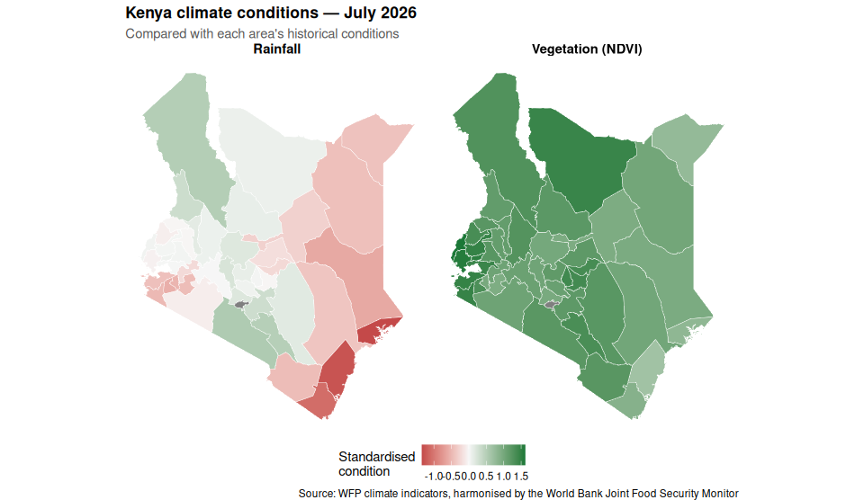
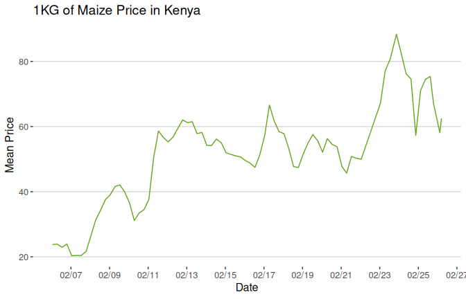

<!-- README.md is generated from README.Rmd. Please edit that file -->

# kenyaFoodPrices

<!-- badges: start -->

[](https://github.com/m-mburu/kenyaFoodPrices/actions/workflows/dowload_data.yaml)
<!-- badges: end -->

This package visualizes food prices and climate conditions in Kenya.
Food-price data is sourced from the World Food Programme (WFP) through
the [Humanitarian Data
Exchange](https://data.humdata.org/dataset/wfp-food-prices-for-kenya?).
Rainfall and vegetation indicators originate from WFP and use the World
Bank [Joint Food Security
Monitor](https://microdata.worldbank.org/catalog/8115) harmonization to
current Kenyan administrative boundaries. The app is hosted on
shinyapps.io and can be accessed
[here](https://mmburu.shinyapps.io/kenyaFoodPrices/).

The Climate tab provides county rainfall and vegetation choropleths
first, followed by county trends and exploratory lagged relationships
with the selected commodity price. See
[CLIMATE_IMPLEMENTATION.md](CLIMATE_IMPLEMENTATION.md) for the download,
processing, data structure, visual design and limitations.

## Latest climate conditions

The maps below show each county’s latest rainfall and vegetation
conditions relative to its historical pattern. Negative values indicate
below-normal conditions, while positive values indicate above-normal
conditions. Open the app’s Climate tab for physical values, county
trends and commodity-price comparisons.



## Installation

You can install the development version of kenyaFoodPrices from
[GitHub](https://github.com/) with:

``` r
# install.packages("devtools")
#devtools::install_github("m-mburu/kenyaFoodPrices")
```

``` r
library(kenyaFoodPrices)
library(ggplot2)
library(dplyr)
library(data.table)
library(ggthemes)
data(ke_food_prices)


ke_food_prices_maize <- ke_food_prices[commodity == "Maize" & pricetype == "Retail" & unit =="KG",]

ke_food_prices_maize[, .(mean_price = mean(price)), by = .(year_quarter_date)] %>%
  ggplot(aes(x = year_quarter_date, y = mean_price)) +
  geom_line(, color = "#66A61E") +
  labs(title = "1KG of Maize Price in Kenya",
       x = "Date",
       y = "Mean Price") +
  scale_x_date(date_labels = "%m/%y", breaks = "24 month") +
 theme_hc()+
  theme(legend.position = "bottom")
```



``` r
# Example usage of the function
display_time_in_timezone("Africa/Nairobi")
#> Last Run On (Your System Timezone): 2026-07-15 17:41:13 Africa/Nairobi
#> Last Run On (Specified Timezone): 2026-07-15 17:41:13 Africa/Nairobi
```

## Acknowledgements

- **World Food Programme (WFP)** for publishing Kenya food-price,
  rainfall and vegetation indicators.
- **World Bank Joint Food Security Monitor team** for harmonising the
  climate indicators to current Kenyan administrative boundaries.
- **World Health Organization (WHO)** for its nutrition and
  public-health guidance, which helps frame the food-affordability
  context of this work.
