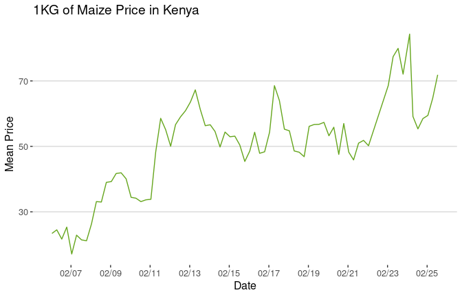

<!-- README.md is generated from README.Rmd. Please edit that file -->

# kenyaFoodPrices

<!-- badges: start -->

[](https://github.com/m-mburu/kenyaFoodPrices/actions/workflows/R-CMD-check.yaml)
<!-- badges: end -->

This is a package to visualize food prices in Kenya. The data is sourced
from the World Food Programme (WFP) and is available on the
[Humanitarian Data Exchange (HDX)
platform](https://data.humdata.org/dataset/wfp-food-prices-for-kenya?).
The app is hosted on shinyapps.io and can be accessed
[here](https://mmburu.shinyapps.io/kenyaFoodPrices/).

## Installation

You can install the development version of kenyaFoodPrices from
[GitHub](https://github.com/) with:

``` r
# install.packages("devtools")
#devtools::install_github("m-mburu/kenyaFoodPrices")
```

``` r
library(kenyaFoodPrices)
library(ggplot2)
library(dplyr)
library(data.table)
library(ggthemes)
data(ke_food_prices)


ke_food_prices_maize <- ke_food_prices[commodity == "Maize" & pricetype == "Retail" & unit =="KG",]

ke_food_prices_maize[, .(mean_price = mean(price)), by = .(year_quarter_date)] %>%
  ggplot(aes(x = year_quarter_date, y = mean_price)) +
  geom_line(, color = "#66A61E") +
  labs(title = "1KG of Maize Price in Kenya",
       x = "Date",
       y = "Mean Price") +
  scale_x_date(date_labels = "%m/%y", breaks = "24 month") +
 theme_hc()+
  theme(legend.position = "bottom")
```



``` r
# Example usage of the function
display_time_in_timezone("Africa/Nairobi")
#> Last Run On (Your System Timezone): 2024-07-24 13:28:49 UTC
#> Last Run On (Specified Timezone): 2024-07-24 16:28:49 Africa/Nairobi
```

- **Thanks to WFP for providing the data on Humanitarian Data Exchange
  (HDX)**
